# 🛒 Grocery App  

A modern **Flutter grocery shopping app** integrated with **Firebase**.  
Users can browse groceries, manage their carts, place orders, update profiles, and sign in using **Google** or **Email + Password**.

---

## 🚀 Features  

### 👥 User Features
#### 🔐 Authentication
- Login & Register using **Email + Password**
- **Google Sign-In** integration
- Firebase Auth + Firestore profile sync

#### 🏠 Home
- Browse grocery products by categories
- View recent and top-selling items
- Add items to cart or mark as favorite

#### ❤️ Favorites
- Save favorite items for quick access

#### 🛒 Cart & Checkout
- Add multiple products to cart
- Auto-calculates total + delivery charge
- Fetches delivery address from user profile
- Checkout creates order in Firestore

#### 👤 Profile Management
- Update **photo**, **name**, **phone**, and **address**
- View **previous orders**
- Logout anytime

---

### 🧑‍💼 Admin Features
The **Admin Panel** allows complete backend management directly from the app.

#### 🧩 Dashboard
- Displays total **Products**, **Users**, **Categories**, and **Orders**
- Each section has a “View All” option
- Logout button to exit Admin mode

#### 📦 Product Management
- View all products in a list view
- **Add**, **Edit**, and **Delete** products
- Product images are uploaded to **Cloudinary** and URLs are stored in **Firestore**

#### 🧾 Order Management
- View all orders from customers
- Update order status: **Pending**, **Shipped**, **Delivered**, **Cancelled**
- View order items, customer address and order date

#### 🗂️ Category Management
- Add new categories with image upload
- Edit or remove existing categories
- Category images uploaded to **Cloudinary**

#### 👥 User Management
- View all registered customers (admins excluded from the list)

---

## ☁️ Firebase & Cloudinary Integration
- **Firebase Authentication** for users and admins
- **Cloud Firestore** for data management
- **Cloudinary** for product & category image storage
- **Firebase Storage** for user profile images (optional)

## 📱 Screenshots  

| Login | Register | Profile | Favorites |
|:-----:|:--------:|:-------:|:---------:|
| 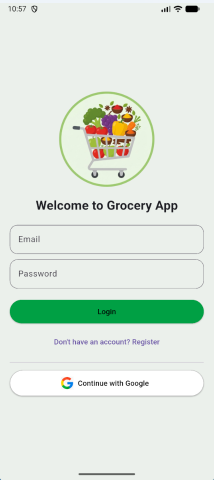 | 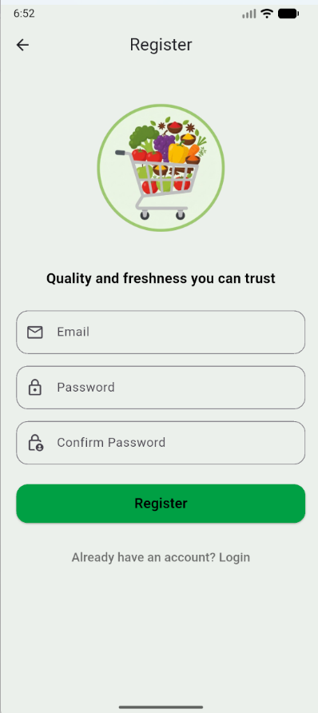 | 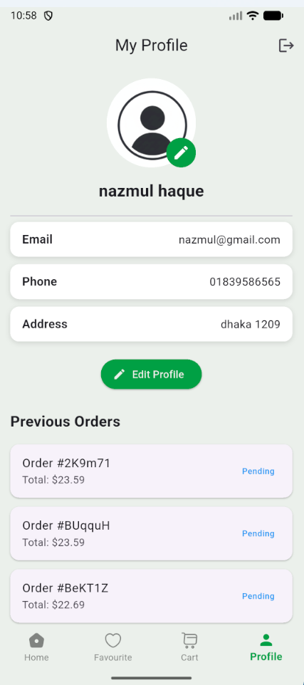 |  |

| Cart | Product Details | Search Products | Home |
|:----:|:---------------:|:---------------:|:----:|
| 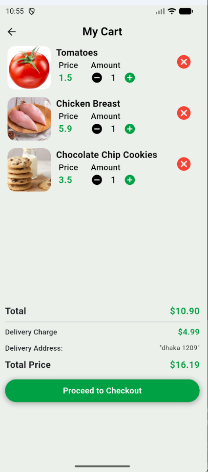 | 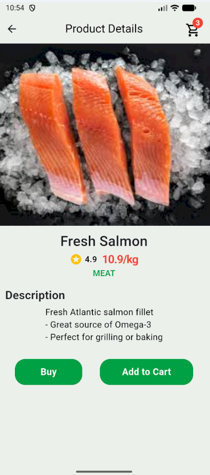 | 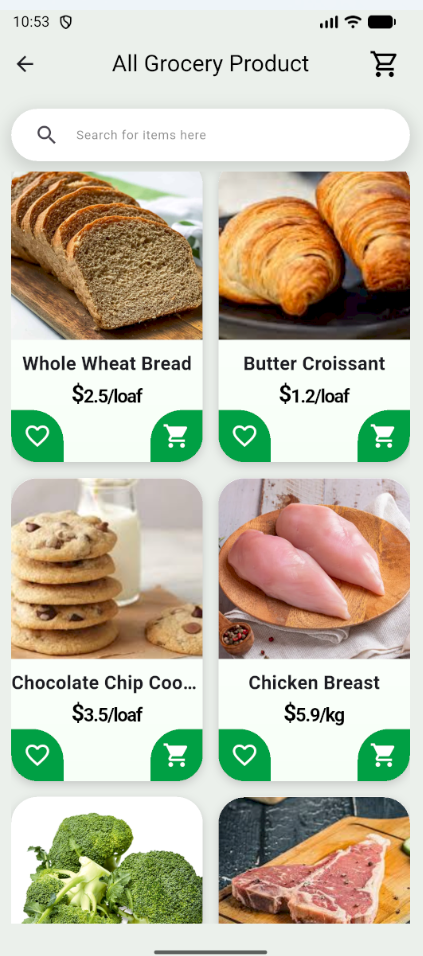 | 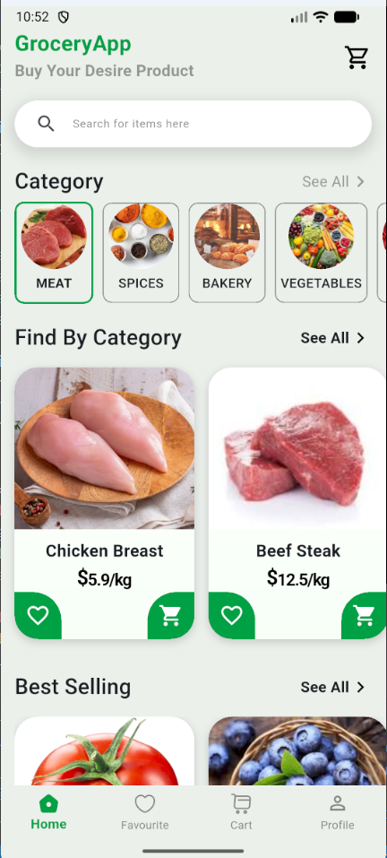 |

### 🧑‍💼 Admin App Screens

| Admin Login | Admin Dashboard | Admin Product | Admin Category |
|:-----------:|:---------------:|:-------------:|:--------------:|
| 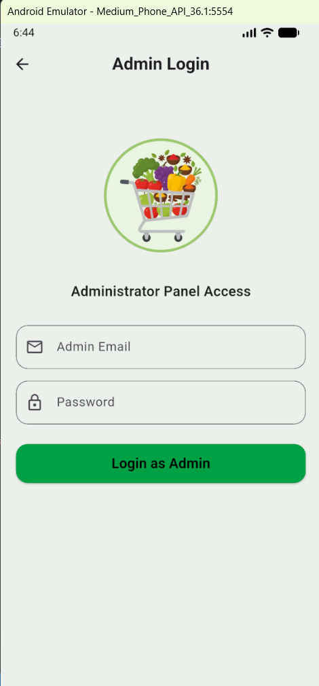 | 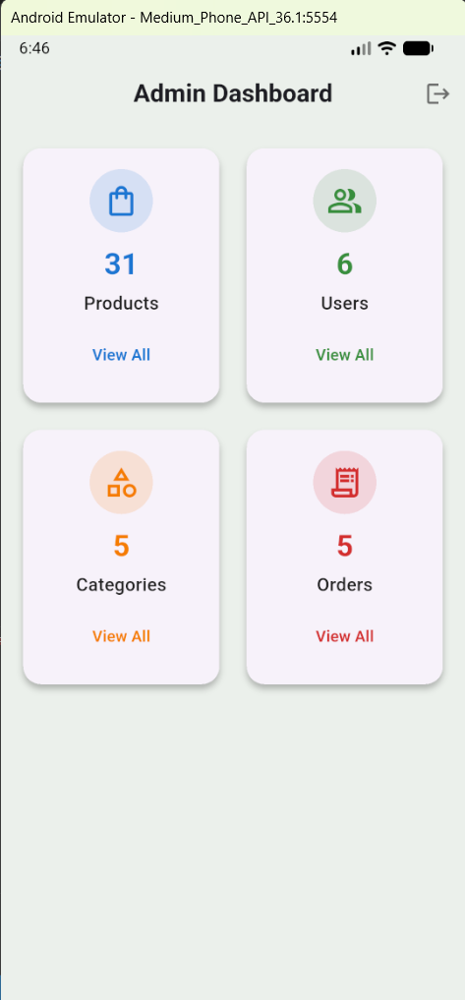 | 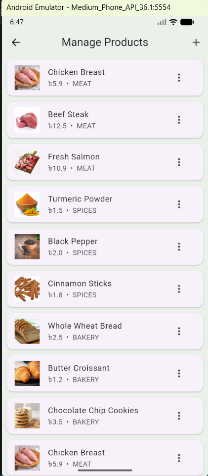 | 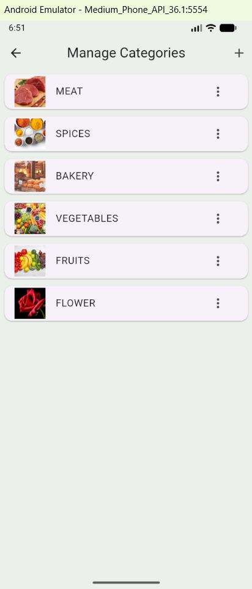 |

 |Admin Order | Admin User |
 |:-----------:|:----------:|
|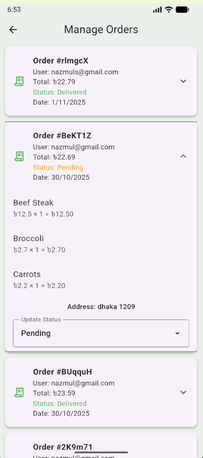 | 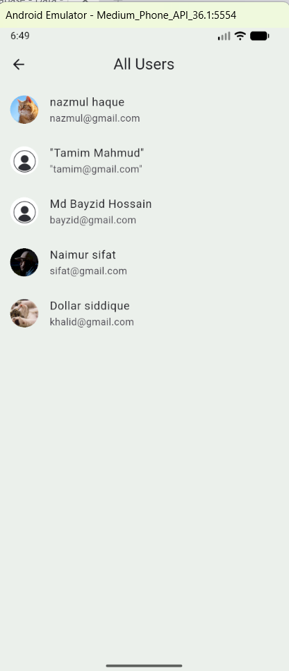 |

---

---

## Tech 

| Technology | Description |
|------------|-------------|
| **Flutter** | Cross-platform mobile app framework |
| **Firebase Auth** | Authentication provider |
| **Cloud Firestore** | Real-time database |
| **Firebase Storage** | Stores user profile images (optional) |
| **Cloudinary** | Stores product & category images |
| **Provider** | State management |
| **Google Sign-In** | OAuth login provider |

---

## ⚙️ Setup Instructions  

### Clone the Repository  
git clone https://github.com/NazmulBhuiyanBD/groceryApp.git
cd grocery_app

### Install Dependencies
flutter pub get

### Run the App
flutter run

